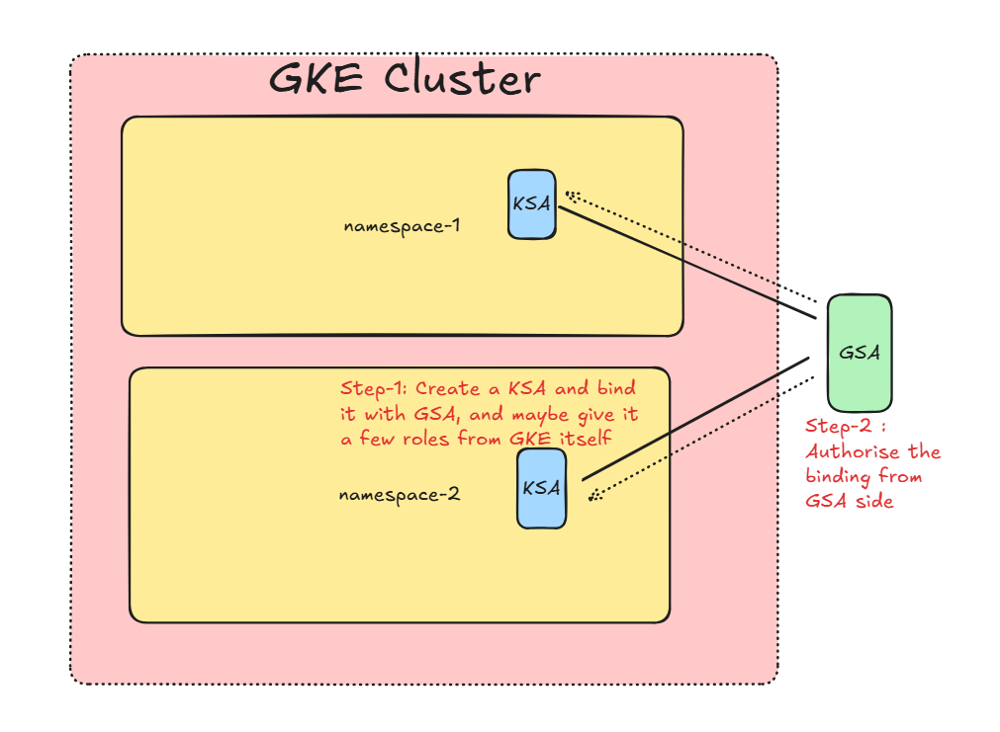
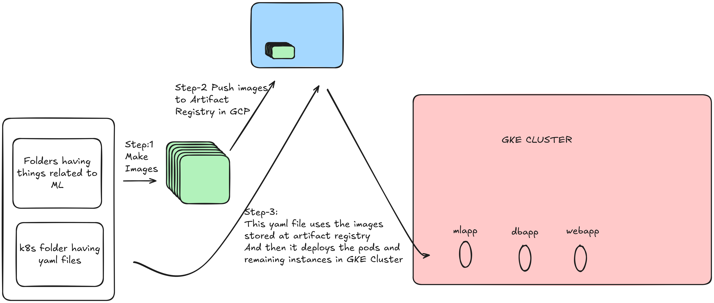
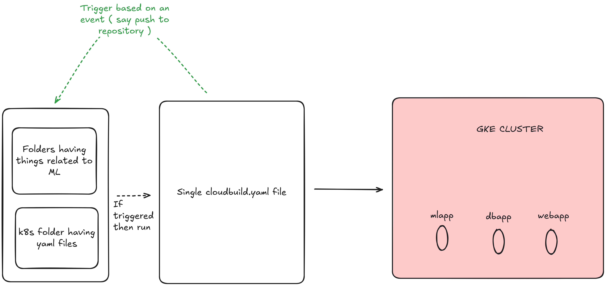
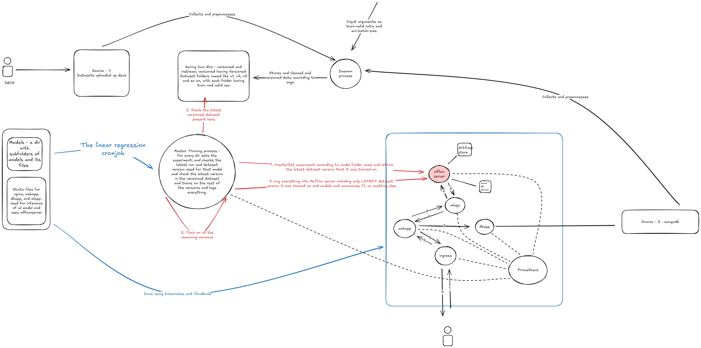

# MLOPS Automation Concepts + Reproducible File

tags: [GCP, Kubernetes, MLFlow, Prometheus, Containerization]

Link to the actual repo : [https://github.com/Hyperspectral01/MLOPs_Automation](images/https://github.com/Hyperspectral01/MLOPs_Automation)

[https://youtu.be/eQNs-uBI1u8 ]

# Concepts Time:

## Basic Level

The Basic Keywords, and pieces of Information that you must be knowing before beginning this ride.

What is a **CONTAINER**? Anything that runs and has its own environment, and solves the “it works on my computer problem”. That is literally it. Sometimes one might create a piece of code using a library lets say “google-cloud-storage”==3.0.0, 5 years later, or lets say on someone else’s PC, the same piece of code doesnt run, because they might have another version of the same package. So you package everything that that piece of code needs to run anywhere, literally anywhere (images/as long as it has some ram and rom 🙂), inside one file called an **image file.**

Now many of these image files follow some convention to build these images, imagine the chaos, if someone use some software and rules “RULE-1” to create an image, and another person uses “RULE-2” to run those images. But generally most of the softwares out there follow **OCI.** Thats the common “RULE” everyone uses for safety and development**.** Feel free to look up on OCI yourself.

Before it gets confusing, the point being, a piece of code along with its packages → Image File → Container.

So the Container is a running instance of that image. Many containers can be spinned up on one Image. You can also inject different environment variables into these images while making the container. Example: You want a process that prints (images/x→100), so make an image out of the code for that file along with its requirements and everything. Then while running the container, you can inject the value of x through command line arguments. And inside that code you just packaged, you can read the value of x from an environment variable lets say x.

This is how everything works. BTW, you can also make containers without any environment variable injection and it is guaranteed to work. 😃

Then these codes inside containers can use a port, lets say 1234, and on your laptop, or whatever machine, port 1234 will be used by that code. These ports can have various endpoints. 

In this project, we have used a webapp, with a “/” endpoint, and when someone hits that “/” endpoint on 1234 port, the app will do something, in this case, it will return an html string using render_template function from flask, basically a web page gets displayed.

Calm down. Flask is a library/framework that helps you to make these apps/codes that can use ports and endpoints. Its that simple. The app can also hit its own endpoint, by using the redirect function (images/also from flask). 

So now you have these codes running different endpoints at different ports, at which, when you hit with a web request, returns something, according to REST types (images/MIME types -  look that up on your own), it could be html, json, string, or anything else, BUT JUST NOT A FLOAT NUMBER, that’s annoying i get it.

| **Return Type** | **Allowed Directly** | **Notes / Fix** |
| --- | --- | --- |
| `str` | Yes | Sent as plain text |
| `dict` | Yes (images/Flask ≥1.1) | Auto-converted to JSON |
| `tuple` | Yes | `(images/response, status, headers)` |
| `Response` object | Yes | Full control over response |
| `jsonify()` output | Yes | Safest for JSON APIs |
| `render_template()` | Yes | Renders HTML page |
| `int`, `float` |  No | Wrap with `str()` or `jsonify()` |
| `list`, `set` |  No | Use `jsonify()` |
| `pandas.DataFrame` |  No | Convert to JSON or HTML first |
| `numpy` types |  No | Convert to Python native or JSON first |

Thats just it. 

And also, when you spin up a container, you gotta connect the port on which the code is supposed to run and the port of the container. Because once a code is written, it is hardcoded to run on one port, no matter what container, but the place where we spin the container might not have that port available. So the idea is that the code runs in its own world at say port 5000. But when we spin up a container it runs on port say 6000, and it connects this port 6000 to the code running at port 5000 inside it.

Basic syntax: docker run -p 6000:5000 —name <container-name> —network <network-name> -v <volume_name>:<mount-path> <image-name>:<tag>

**-p** is for mapping of ports like i mentioned.

**—name** is to give the container a name. 

**—network** is to put it on a network

**-v** is to make a volume mounted at a path inside the container

**image name** and the **tag** is just the context for the container to start running.

Concept of **state** and **statelessness:**  It is very simple. lets say you have a code that counts every second that it is running for. You make an image, then spin off a container, simple so far. Now you delete that container, and spin off a new one but you want it to continue the counting. But it starts counting from 1. Hence the state is not preserved/**PERSISTED.**

But if container-1, had a folder called “myapp” inside which you install the requirements and start running the code, then you can have a volume called, say, **my_count_volume,** and that can be mounted at /myapp inside the container, so basically like a copy of /myapp gets stored inside the container, and you could write the count to a text file or something inside that container.

Now when the container gets deleted, a new container can be spinned, and the same volume can be attached at the same place, where the text file had the count written inside it. Now you can program to start counting from that count. Without volumes, you would delete the container, and hence the text file with it. But now everything is persisted.

Lets level up, now one code wants to hit a ip:port/endpoint where another code is running, the catch is, both are inside their own containers. Now You might say this is gonna work (images/since app1 will hit a request on localhost://5000 where app2 runs on the same device at 5000, and the container also runs at 5000 mapped to the 5000 at which app2 runs). But lets say the guy who is running the image in a container always runs it on different ports for fun, (images/ obviously since the ports are not available). 

Then the same guy can also run it on some other machine with internet connectivity, then [localhost](images/http://localhost) will definitely fail, hehe.

The point being there are only 2 things that can remain the same everytime, the container name, and the port at which app2 is running inside the container. The app1 running inside will then hit a request to http://CONTAINER_2_NAME:INTERNAL_PORT_OF_APP2/ENDPOINT

So gotta make sure that the app2 runs on a container with a particular name. Thats it. Thats the rule we use in DOCKER.

Some apps are **stateful** and the others are **stateless**, like for example a database, that stores something, and to maintain its availability, lets say—keep up with me—we spin up 5 containers of that database application (images/ think of database application like storing some data ), and we do load balancing between them. So one request goes to CONTAINER-1, other goes to CONTAINER-2, and some other might go to CONTAINER-3 and so on. Now the funny thing is, that these CONTAINER-1,2..5 are not in sync with each other. Lets say they have been connected to a common store (images/ like a GCP Bucket , hehe, we will come to that too)  then the, syncing problem will be gone. Then in that case, if one container say blows up, then nothing will be affected.

Lets say, only one container of this same database is running, if somehow, in cloud environment its very common, that some hardware gets an issue, and the container running on that hardware will stop/terminate. Then Kubernetes or some other sort of a Manager, will spin up another container/pod/running instance and that will be of no use. Because the data inside old container is lost.

Hence connecting a common volume/storage is important for **statelessness.**

## Intermediate Level:

Now we are in the domain of **Kubernetes**.

What is **KUBERNETES**:

 The basic definition from google (images/i am lazy):

Kubernetes is **an open-source system for automating the deployment, scaling, and management of containerized applications**

Or as my Sir says, it is a **container orchestration platform.** 

Fancy words, but is it simpler than that? - yes and no. 😎

Continuing our story of containers and images and port and endpoints. It is important to note that on cloud it isn’t that simple. Imagine running a container, and the hardware on which it runs in some datacenter, on piece of of land somewhere, is faulty. The container crashes, do we have to manually restart the container? → solution→**POD HEALING and AUTOMATIC RESTARTS.**

Lets say that same container is running on a machine and that has a public ip.  You want to change the code without having anydowntime on that same ip and port….. Can you do that? → solution→**ROLLING UPDATES**

Similarly, these are the other features given by Kubernetes:

| **Feature** | **What it does** |
| --- | --- |
| **Self-healing** | Restarts crashed pods, replaces failed nodes |
| **Rolling updates** | Updates apps with zero downtime |
| **Load balancing** | Distributes traffic across pods |
| **Auto-scaling** | Scales pods up/down based on load |
| **Service discovery** | Finds pods via DNS or IP |
| **Storage orchestration** | Manages volumes + persistent data |
| **Secret & config management** | Securely handles env vars, creds |
| **Batch execution** | Runs jobs & cron jobs easily |
| **Resource monitoring** | Tracks CPU, memory, etc. |
| **Horizontal & vertical scaling** | Scales pods or resources dynamically |
| **Namespace isolation** | Organizes multi-tenant environments |
| **Declarative configuration** | Everything defined via YAML (images/infra as code) |

Lets say that same container is running on a machine and that has a public ip. Now you want to update the code, so you will every time, create an image, create a container, and deploy that container and hope evrything is fine, everything was manual in this step, but in large scale environments and code bases, doing things manually can break anything. There is no versioning for anything. To go back to a version of code that existed 3 months back, you need **VCS (images/Version Control System)** like **Github**.

Even in our project, the VCS will be Github.

### How Things Work in Kubernetes?

Kubernetes internally uses docker for making images and deploying them, so commands are gonna be a little familiar.

So you run a code, if it works, you version it, you make an image, you push that image or store that image somewhere, and then you run that image to make a container.

The Catch is , kubernetes doesn’t like the term **CONTAINERS**, but rather **PODS**

These pods can have one or more containers running inside them. So if you run 2 containers inside one pod, these are called **tightly coupled containers**. And just like docker, if you wanna make these containers talk to each other you can do that on http://localhost:port, think of a pod like an individual laptop/computer/hardware/machine. It has an IP, and this IP could be private or public.

So for the example above, the two containers in one pod, are like two containers running on the same machine, hence same ip, hence [localhost](images/http://localhost) would work. The only limitation being that these containers cannot run on the same port.

But a healthy practice is to keep different containers, different microservices separate from each other rather than tightly coupled.

So you have the CODE now, and an image somewhere, but this thing called a POD might have a bunch of configurations (images/in docker one command was enough)…. hence comes a file type we will use everytime, all the time, and literally most of the time. **YAML FILES**

So once we have image, to make this POD, we will be having a YAML file. And as soon as we use kubernetes commands to run this yaml file, it will create this thing called POD.

But not everything is called a **POD.**

As we will see in the below section, a running instance of a code is a Container in Docker, but in Kubernetes, it can be one of the following things:

### **1. Deployment**

Defines **Pods + how many replicas** you want.

Creates and manages containers automatically.

Every POD has an IP, that might keep changing according to how and where kubernetes deploys it. So changing IP’s but the metadata of these pods remain same.

```yaml
kind: Deployment
apiVersion: apps/v1
metadata:
  name: webapp-deployment
spec:
  replicas: 3
  template:
    spec:
      containers:
      - name: webapp
        image: myimage:v1

#ALSO IN THE METADATA SECTION WE CAN GIVE SOMETHING CALLED LABELS, AND ACCORDING TO THESE LABELS WE CAN USE MATCHLABELS TAG INSIDE THE SPEC TO APPLY THIS TEMPATE TO EVERYTHING CALLED LABELS. SO IT APPLIES THESE RULES LIKE REPLICAS AND SO ON TO EVERYTHING CALLED "X" BY USING MATCHLABELS, AND INSIDE METADATA THIS SAME "X" CAN BE MENTIONED INSIDE THE TAG LABELS.
```

---

### **2. Service**

Exposes Pods to other Pods (images/or the internet).

 Acts like a **load balancer / DNS name** for a group of Pods.

Since the pod’s ip’s keep changing, we need a stable IP that connects us to every pod called “X” (images/example given above) hence the selector: app: inside the below code. And just like docker, we can connect the service port to the pod port, wherein the first is stable and the second one keeps changing.

```yaml
kind: Service
apiVersion: v1
metadata:
  name: webapp-service
spec:
  selector:
    app: webapp
  ports:
    - port: 80
      targetPort: 8080

```

---

### **3. ConfigMap**

Stores **non-sensitive** configuration (images/like environment variables, URLs).

Lets you change config without rebuilding the image.

These are variables you can store which the other pods can pick up in their environment, by mentioning the name of the configmap and the name of the variable.

```yaml
kind: ConfigMap
apiVersion: v1
metadata:
  name: app-config
data:
  DB_HOST: my-database
  LOG_LEVEL: debug

```

---

 How the other yaml files will be using these variables (images/example):

```jsx
apiVersion: apps/v1
kind: Deployment
metadata:
  name: webapp
spec:
  replicas: 2
  selector:
    matchLabels: { app: webapp }
  template:
    metadata:
      labels: { app: webapp }
    spec:
      containers:
      - name: webapp
        image: myapp:latest
        env:
        - name: DB_HOST
          value: mysql-service
        - name: DB_PASSWORD
          valueFrom:
            secretKeyRef:
              name: db-secret
              key: ROOT_PASSWORD
```

### **4. Secret**

Same as ConfigMap but **for passwords, keys, tokens** — base64 encoded.

Now things like usernames and passwords cant be kept as configmaps, since they require higher level of security and also, sometimes, (images/in a public repo), you dont want others to just simply read the files and get your passwords 😂, do you? hence we can set these up directly in console, or with the help of the yaml files given below.

```yaml
kind: Secret
apiVersion: v1
metadata:
  name: db-secret
type: Opaque
data:
  DB_PASSWORD: cGFzc3dvcmQxMjM=  # base64 for 'password123
```

---

### **5. PersistentVolumeClaim (images/PVC)**

Used to **store data permanently** (images/so Pods don’t lose it when restarted).

```yaml
kind: PersistentVolumeClaim
apiVersion: v1
metadata:
  name: app-storage
spec:
  accessModes:
    - ReadWriteOnce
  resources:
    requests:
      storage: 1Gi

```

---

### **6. Ingress**

Defines **external HTTP routes** — like a reverse proxy.

```yaml
kind: Ingress
apiVersion: networking.k8s.io/v1
metadata:
  name: webapp-ingress
spec:
  rules:
  - host: myapp.example.com
    http:
      paths:
      - path: /
        pathType: Prefix
        backend:
          service:
            name: webapp-service
            port:
              number: 80

```

---

### **7. Job / CronJob**

Runs **one-time** or **scheduled** tasks.

Example — daily data cleanup:

**NOTE:**  JOB RUNS ONLY ONCE, CRONJOB HAS A JOB SECTION INSIDE IT THAT CAN RUN THIS JOB MANY TIMES BY SPAWNING IT ACCORDING TO A SCHEDULE.

```yaml
kind: CronJob
apiVersion: batch/v1
metadata:
  name: cleanup-job
spec:
  schedule: "0 0 * * *"
  jobTemplate:
    spec:
      template:
        spec:
          containers:
          - name: cleanup
            image: cleaner:latest
          restartPolicy: OnFailure

```

Also, some guys who really know their stuffs, would know, how the yaml parsing works differently on “*” and “$” in this yaml file and how it can make injection of live variables during runtime into this file very frustrating, however, if you dont get it, you dont need to know it right now.

So a short summary would be:

| YAML Type | Purpose |
| --- | --- |
| **Deployment** | Runs and manages Pods |
| **Service** | Exposes Pods via stable name |
| **ConfigMap** | Stores plain configuration |
| **Secret** | Stores sensitive data |
| **PVC** | Provides storage persistence |
| **Ingress** | Routes external HTTP traffic |
| **Job/CronJob** | Runs one-time or scheduled tasks |

Also There are 4 service types (images/ the ones we talked about for a stable ip for a bunch of pods ):

### Service Types

1. ClusterIP (images/default**)** → internal access *within cluster only*.
2. NodePort → exposes app on every node’s port (images/for local testing).
3. LoadBalancer ****→ for cloud; gives **external IP** via cloud load balancer.
4. ExternalName → maps service name to an *external DNS.*
    
    
    A Note on the above:
    
    Local dev → `NodePort`
    
    Internal comms → `ClusterIP`
    
    Cloud prod → `LoadBalancer`
    

Remember when we were talking about how two apps in two different containers in docker communicate with each other, and how in this case, we use service-name to facilitate communication between different pods.

The exact method of communication is `“http://<service-name>.<namespace>.svc.cluster.local:<service-port>”` where: 

| Part | Meaning |
| --- | --- |
| `<service-name>` | **Service name** (images/from your Kubernetes YAML) |
| `<namespace>` | **Namespace** in which the service is running |
| `svc` | Indicates this is a **Kubernetes service** |
| `cluster.local` | The **default internal DNS domain** for all services inside your cluster |
| `:5000` | The **port** on which your service is exposed |

### Now let’s go to GCP……………Google Cloud Platform

There are various features of GCP:

Since many people are already familiar with the know-hows of **AWS** Cloud Platform, i have given a brief comparison between `AWS and GCP`:

### Compute (images/running code)

| AWS | GCP | Use |
| --- | --- | --- |
| **EC2** | **Compute Engine** | Virtual machines (images/full control) |
| **Lambda** | **Cloud Functions** | Run short code pieces on events (images/serverless) |
| **ECS / EKS** | **Cloud Run / GKE (images/Kubernetes Engine)** | Run containers (images/auto or full control) |
| **Batch** | **Batch / Dataflow** | Heavy background jobs or data processing |

---

### Storage

| AWS | GCP | Use |
| --- | --- | --- |
| **S3** | **Cloud Storage** | Store files, datasets, models (images/object storage) |
| **EBS** | **Persistent Disk** | VM-attached block storage |
| **EFS** | **Filestore** | Shared file system for multiple VMs/Pods |
| **Glacier** | **Archive Storage** | Long-term, cheap backup |

---

### Databases

| AWS | GCP | Use |
| --- | --- | --- |
| **RDS** | **Cloud SQL** | Managed MySQL/Postgres/SQL Server |
| **DynamoDB** | **Firestore / Datastore** | NoSQL key-value/document DB |
| **Redshift** | **BigQuery** | Analytics / Data warehouse |
| **ElastiCache** | **MemoryStore** | Managed Redis / Memcached |

---

### AI / ML

| AWS | GCP | Use |
| --- | --- | --- |
| **SageMaker** | **Vertex AI** | Train, deploy, manage ML models |
| **Comprehend / Rekognition / Polly** | **Vision / NLP / TTS / Translation APIs** | Prebuilt AI models |

---

### Integration & Messaging

| AWS | GCP | Use |
| --- | --- | --- |
| **SQS / SNS** | **Pub/Sub** | Messaging / event passing |
| **Step Functions** | **Workflows / Composer** | Orchestration / pipeline control |

---

### Identity & Access

| AWS | GCP | Use |
| --- | --- | --- |
| **IAM** | **IAM** | Manage permissions & roles |
| **KMS** | **Cloud KMS** | Encrypt/decrypt keys |
| **Secrets Manager** | **Secret Manager** | Store API keys, passwords |

---

### Monitoring & DevOps

| AWS | GCP | Use |
| --- | --- | --- |
| **CloudWatch** | **Cloud Monitoring / Logging** | Logs, metrics, alerts |
| **CodePipeline / CodeBuild** | **Cloud Build / Cloud Deploy** | CI/CD pipelines |
| **CloudFormation** | **Deployment Manager / Terraform** | Infra as code |

---

<aside>
💡

**In our project: we have used GKE (images/Kubernetes Engine), Cloud Storage, Cloud SQL, IAM, Cloud Build from GCP Platform, and additionally also used MLFLow for Model Tracking and Registration, and Prometheus for collecting metrics and monitoring all web apps.**

</aside>

# Understanding CORE concepts used in this project:

**GSA : Google Service Account** : This is the master card that has various permissions attached to it. It is almost like walking inside a high security building (images/Kubernetes in this case) with a master card in your hand. You can give various permissions to it like Arftifact Registry Administrator, Storage Object User, and so on. 

**KSA : Kubernetes Service Account** : This is like the card that would be used by instances inside the GKE (images/Google Kubernetes Engine). Lets call it a Local card right now. So in the world of google cloud, it is the GSA, but as soon as you go to the console and use GKE services, inside that world only KSA works, not GSA. So now if a pod wants to access a storage device from google cloud, like lets say, a bucket, then KSA has to be somehow linked to GSA so that the permissions that a GSA has can be used by a KSA. Keep that idea hanging for a second.

**Namespace:** To make logical divisions of all your resources inside a GKE cluster (images/ which might have pods for website frontend and might also have pods for database, and also pods for machine learning models, so many pods), we use something called a Namespace. It is like creating a Virtual Cluster inside a GKE cluster to keep things tidy and clean. So now, the Secrets, ConfigMaps, and even KSA (images/ back to it hehe ) remain separate in separate namespaces. But we can still have the same GSA.

Now keep up, remember we talked about the local card and master card, and we talked about trying to somehow link our KSA in a particular namespace to a GSA, is happens with something called a **Workload Identity Binding.** 

It is a **2-step process.**

```
Just remember, when it is someone trying to contact the GCP services like buckets or something, it is a 2 step process.
0. You would already have GSA (images/Google service account) (images/that is your master card) -> This can be created from GCP UI and various permissions can be provided
1. Create a KSA (images/thats like your namespace scoped card) and add an annotation (images/the link/ the wire between the two cards) (images/can be done as yaml or commands)
2. Authorise workload identity from the GSA side (images/done using commands)
```



But what if a pod running inside a GKE wants a permission to delete/create another pod.

What permission would it need and where do you get it? GSA can only give permissions to the things involving google cloud as a whole: like buckets and databases and artifacts, all of which are separate things in GCP.

But for a situation such as this, GKE has got its own roles system. So basically a KSA can be created, and then certain roles can be given to it by GKE (images/ for functioning within GKE ), and optionally a KSA can be linked to GSA as well to grant it permissions over google cloud objects.

Now, anyone inside this GKE cluster using that KSA, will have all its benefits including the GSA permissions if attached and also the GKE roles to manipulate things inside GKE.

This process of giving of roles to KSA by GKE is called **RBAC (images/ Role Based Access Control )** and is outlined below:

```yaml
And when it is that you want to manipulate and play around with pods using other pods, then the pods who would be creating or restarting those other pods would require certain permissions. So hehe, basically a 3 step process.
0. Create a KSA (images/which is your namespace scoped card) (images/can be done as yaml or commands) [and then optionally an annotation but that is not required]
1. Create a ROLE that gets access to certain actions and resources (images/can be done as yaml or commands)
2. Create a ROLEBINDING that binds the above created ROLE to the KSA (images/can be done as yaml or commands)
```

But no matter how you create the KSA, and/or the annotations and role bindings, through the yaml or the commands, finally the KSA name should be mentioned in the yaml files of the individual pods that want to use it.

**Basic Architecture:**


Source: Medium

The Data Plane consists of Nodes and these nodes have scopes, and limitations as to what cab be accessed by resources in these nodes, like whether GCS services can be accessed or not?

These are:

| **Scope** | **Access** |
| --- | --- |
| `compute-rw` | Read/write Compute Engine stuff |
| `storage-ro` | Read-only GCS |
| `storage-rw` | Read/write GCS |
| `logging-write` | Send logs to Cloud Logging |
| `monitoring` | Send metrics to Cloud Monitoring |
| `bigquery` | Access BigQuery |
| `cloud-platform` | Full access to all GCP APIs (images/best for flexibility) |

We have to make sure that our nodes in our cluster are cloud-platform scoped…. hence it is free to use any resources and will not be blocked by GKE itself.

**What is CloudBuild?** It is a CI-CD service that is provided by GCP. It has a script that it runs everytime an event happens, either a push on a repo linked to that trigger or mayber something else. It easily integrated with github, IAM and so on. It is one of the easier tools to use in GCP.

So as long as you have a script to run, a codebase and a condition that triggers that script to run, you can easily build a CI-CD Pipeline. For more information about CI-CD Pipelines : click here to see my other project on Microsoft Azure Machine Learning to build and deploy ML Pipelines from scratch : https://github.com/Hyperspectral01/AzureML_Step-by-Step_Pipelining

**Triggers:**

Talking about triggers, i was thinking how should i build my project, should it be the code of ML models, training and inference in one repo, and code about the webapp, and dbapp in another repo.

But that really made no difference, since keeping these codes in one single repo and building a MONO-REPO project and making a MULTI-REPO project was the same thing. The idea then was to use different triggers, one for the ML MODELS CODES, and second one for the WEB APPLICATION CODES. You can literally set two different pipelines, two triggers, one for each of the folders in the repo. All of this can be configured inside Triggers Section of GCP.

### A Basic Pipeline:



However these 3 steps can be condensed in **one yaml file** called the cloudbuild.yaml file



# PROJECT SETUP:

Link to the actual repo : [https://github.com/Hyperspectral01/MLOPs_Automation](images/https://github.com/Hyperspectral01/MLOPs_Automation)

## Visualisation:




## Basic information:

There are **two namespaces** in the GKE cluster:

1.**ml**: Used for ml related deployments and Cronjobs

2.**web**: Used for web related deployments and services.

The **Features** of the project:

1. The User will be able to correct the predicted prices which will then be taken into the preprocessing step and then finally into the versioned dataset step. (images/ **Evolving** models )
2. If we wish to bring **another model** into the picture, we can also make a separate folder in the models folder of the repo, and give it the necessary file like yaml files and retraining files, so it will automatically create an experiment related to that model and train every model separately.
3. Attention has been given to **versioning of datasets** and also no model is trained on the same data twice.
4. Variables like **Batch size** and **train_test_split** are directly mentioned in the ConfigMap-1 which can be changed and it will be taken into account by the Data Preprocessor.
5. Data can also be **uploaded** directly to GCS.
6. **MLFlow** is used to register models, track them, and each version is also given tags to mention the version of the dataset that it has been trained on.
7. **Prometheus** has been used to scrape metrics from the /metrics endpoint of webapp, mlapp, and dbapp.
8. External IP’s has been given to MLFlow and webapp via an **Ingress** for each of them, (images/type nginx for mlflow) and Prometheus service is of type load-balancer hence giving it a **public IP.**
9. Both the pipelines are made to **trigger on the same repo but on different folder**, hence maintaining separation of concerns.
10. Stateful pods like those of mlflow are also taken into account by connecting it to a **PostgreSQL** instance for metadata storage and to a bucket (images/ bucket-3 ) for **artifacts storage.**
11. Both the web and ml spaces are kept different via namespaces **ml** and **web.**
12. **Secrets** have been maintained for PostgreSQL URI and MongoDB URI, so that usernames and passwords remain safe.
13. Scanning across all runs and models so far, we take the **best model for inference from mlflow.**

## Steps (images/Completely reproducible) [  https://youtu.be/eQNs-uBI1u8 ]:

1. **WHAT TO KEEP TRACK OF ?** :These are the things you would be required to store throughout all of these steps: 
    
    `MONGO_DB: <your-database-name>`
    
    `COLLECTION_1: <your-table-1-name-here>`
    
    `COLLECTION_2: <your-table-2-name-here>`         
    
    `BUCKET_1: <BUCKET-1-name-here>`
    
    `BUCKET_2: <BUCKET-2-name-here>`
    
    `BUCKET_3: <BUCKET-3-name-here>`
    
     `POSTGRESQL_URI: "postgresql://<USER>:<PASSWORD>@<PRIVATE_IP>:<PORT>/<DATABASE_NAME>"`
    
    `MONGO_URI: “<you get this from mongo db→clusters→connect→app→get the connection string then enter your username and password inside that uri>”`
    
    `PROJECT_ID: <your project id>`
    
2. **MONGODB SETUP**: First login to [https://www.mongodb.com/](images/https://www.mongodb.com/) MongoDB database and go to clusters and create a free cluster (images/ one free cluster can be created ). Then go to “Clusters” on left hand side and then click on “Connect”→”app” → store your MONGO_URI as mentioned in step-1. Then click on “Browse Collections”, then “Create a new database” and give a name to the database. Store this name as well. Then create 2 empty collections inside that Database, and store their names also. Then under “Networks Access” tab→”IP ACCESS LIST”→ “From anywhere” /  “0.0.0.0” rule to that cluster so that anyone can contact that database. Also go to “Database Users” , then add your username and password and make sure you give the role “**readWriteAnyDatabase**@admin”. Make sure to add the user_id and password inside the mongo_uri. (images/ NOTE: MAKE SURE TO NOT INCLUDE @ IN THE PASSWORDS SINCE THEY WILL HAVE TO BE ESCAPED IN THE URI OTHERWISE )
3. **CREATE A PROJECT**: Go to GCP console dashboard and then login. Then Create a new project, it will then generate a new project name from the given project name (images/ because it has to be unique ).  After creating this new project you will be able to see on the top left hand side your project name. Click there and copy and store your full project id. 
4. **ENABLE API’S** : Then briefly go to the cloud console shell in the top right hand side corner and run the following command to enable API for certain services. It makes those services literally accessible to us.

```bash
#Wait a few seconds this might take some time

#If during the course of the entire setup a service has to be enabled, it will pop up on the UI and it can be enabled manually on the UI or through the command line

gcloud services enable \
[container.googleapis.com](images/http://container.googleapis.com/) \
[cloudbuild.googleapis.com](images/http://cloudbuild.googleapis.com/) \
[iam.googleapis.com](images/http://iam.googleapis.com/) \
[cloudresourcemanager.googleapis.com](images/http://cloudresourcemanager.googleapis.com/) \
[sqladmin.googleapis.com](images/http://sqladmin.googleapis.com/) \
[run.googleapis.com](images/http://run.googleapis.com/) \
[secretmanager.googleapis.com](images/http://secretmanager.googleapis.com/) \
[artifactregistry.googleapis.com](images/http://artifactregistry.googleapis.com/) \
[storage.googleapis.com](images/http://storage.googleapis.com/)

```

1. **SETUP POSTGRESQL INSTANCE**: The aim is to create a postgresql instance with a database, and a user id and password, but we have to make sure that it exists in the same vpc as the cluster, so basically the same region, the cluster can be zonal also, so it will work.  Also make sure Private IP access is enabled (images/ it is already ensured in the commands given below). Just run the commands below and it will create postgresql instance with private ip access enabled in the same vpc (images/ default vpc ) as the gke clutser that we will create later. For this entire project we have selected only (images/ Region-us-central1 (Iowa) ),and (images/ zone: us-central1-a )

```bash
#enabling a few extra services
gcloud services enable servicenetworking.googleapis.com sqladmin.googleapis.com

#Now the postgresql instance that we will create will be made inside the Google-managed-services's own VPC network, so it is not yet available inside our already existing "default" VPC network, so we gotta PEER them, which means, to CONNECT THEM
#Thats what the next few steps are about......

#These steps are to create a VPC Peering
gcloud compute addresses create google-managed-services-default \
  --global \
  --purpose=VPC_PEERING \
  --prefix-length=16 \
  --network=default

#I have used the "default" VPC in my project, so no creation of a separate VPC is required
gcloud services vpc-peerings connect \
  --service=servicenetworking.googleapis.com \
  --network=<vpc-name> \
  --ranges=google-managed-services-default
  
  # To verify the peering
gcloud services vpc-peerings list --network=<vpc-name>

  
 
# Take special care of the regions and zones
#Also we did create a vpc peering to default network
#Usually vpc name is default and region is us-central1 and zones can be us-central1a,us-central1-b and so on.
#That is the difference between networks and zones
#The postgresql instance is regional (images/ available inside an entire region ), and the cluster that we will create can be regional or zonal
gcloud sql instances create <postrges-instance-name> \
  --database-version=POSTGRES_15 \
  --region=us-central1 \
  --network=<vpc-name> \
  --no-assign-ip \
  --storage-size=20GB \
  --cpu=2 \
  --memory=7680MB
  
  
#This is to get the private IP of the instance, you can also get this through the UI, by searching for "CloudSQL" on the searchbar in the google console"
gcloud sql instances describe <postgresql-instance-name> --format="value(images/ipAddresses)"

#Make sure to set and store the database name, it will be used to construct the URI
gcloud sql databases create <your-database-name> \
  --instance=<postgresql-instance-name>

#or if you create your own user and pass, can do that but make sure to construct the uri in the below given format
gcloud sql users create <your-user-name> \
  --instance=<postgresql-instance-name> \
  --password=<your-password>
  
#Make sure the password does not have @ and so on, since the URI parsing can create a problem 

```

```bash
#The Port in this URI can 
Make sure you have this kind of uri created : postgresql://<USER>:<PASSWORD>@<PRIVATE_IP>:<PORT>/<DB_NAME>

```

1. **SETUP BUCKETS**: Then again go to the search bar at top of screen and search “Buckets”. Create three new buckets, and since the name of the buckets will be unique throughout GCS, the first part of the name of the bucket will be based on project-id. Then create these buckets store their names. Also in bucket number 2, create 2 folders specifically with the name “versioned” and “instream”. This will be used to store all the preprocessed data, versioned ones in the versioned (images/ according to the batch-size and train-test-split from the configmap-1.yaml) and the ones who do not qualify the batch size yet, go into instream.

```bash
# For an easier covention these names have been chosen
# I had chosen the location us-central1, a region
gcloud storage buckets create gs://<Project-id>-bucket-1 --location=<region>
gcloud storage buckets create gs://<Project-id>-bucket-2 --location=<region>
gcloud storage buckets create gs://<Project-id>-bucket-3 --location=<region>
```

1. **CREATE GSA**: Then again go to the search bar and search “Service Accounts”, then “Create Service Account.” Then give it a name, make sure to give the name and the service account id as same to avoid any confusions later on. And store the complete Service Account ID which will be of the type: `<serviceaccountname>.<project-id>@iam.gserviceaccount.com` Make sure to store this. This is your SERVICE ACCOUNT EMAIL.     [or]   You can use the command given below

```bash
#The command to create a service account
gcloud iam service-accounts create <your-service-account-name> \
--display-name="My service account"

# Grant it the Owner role
gcloud projects add-iam-policy-binding $(images/gcloud config get-value project) \
  --member="serviceAccount:mygsaaccount@$(images/gcloud config get-value project).iam.gserviceaccount.com" \
  --role="roles/owner"
```

1. **GIVE PERMISSIONS TO GSA**: Now enable the cloud shell from the top right hand side corner.

Then to give your GSA that you just created the following roles:

> App Engine Admin
Artifact Registry Administrator
Artifact Registry Attachment Writer
Artifact Registry Create-on-Push Repository Administrator
Artifact Registry Create-on-Push Writer
Artifact Registry Writer
Cloud Build Editor
Cloud Build WorkerPool User
Cloud Functions Developer
Cloud KMS CryptoKey Decrypter
Cloud Run Admin
Cloud SQL Admin
Cloud SQL Client
Cloud SQL Editor
Cloud SQL Instance User
Compute Instance Admin (images/v1)
Edge Container Zonal Project Viewer
Environment and Storage Object Administrator
Environment and Storage Object Viewer
Firebase Admin
Integrated Service Telemetry Logs Writer (images/Beta)
Kubernetes Engine Admin
Kubernetes Engine Developer
Logging Admin
Logs Bucket Writer
Logs Configuration Writer
Logs View Accessor
Logs Viewer
Logs Writer
Private Logs Viewer
Secret Manager Secret Accessor
Service Account User
Storage Admin
Storage Bucket Viewer (images/Beta)
Storage Object Admin
Storage Object Creator
Storage Object User
Storage Object Viewer
> 

To give these roles, copy and paste this command into shell and run it.

```bash
PROJECT_ID="your-project-id"
GSA="your-service-account@${PROJECT_ID}.iam.gserviceaccount.com"
```

```bash
#Many of these permissons will be required, many for logging, many for enabling "create dir on push images", many for just pushing the images and so on....

gcloud projects add-iam-policy-binding $(images/gcloud config get-value project) \
  --member="serviceAccount:mygsaaccount@$(images/gcloud config get-value project).iam.gserviceaccount.com" \
  --role="roles/owner"
  
 
for ROLE in \
roles/appengine.admin \
roles/artifactregistry.admin \
roles/artifactregistry.writer \
roles/artifactregistry.createOnPushRepoAdmin \
roles/artifactregistry.createOnPushWriter \
roles/artifactregistry.writer \
roles/cloudbuild.editor \
roles/cloudbuild.workerPoolUser \
roles/cloudfunctions.developer \
roles/cloudkms.cryptoKeyDecrypter \
roles/run.admin \
roles/cloudsql.admin \
roles/cloudsql.client \
roles/cloudsql.editor \
roles/cloudsql.instanceUser \
roles/compute.instanceAdmin.v1 \
roles/edgecontainer.zonalProjectViewer \
roles/logging.admin \
roles/logging.bucketWriter \
roles/logging.configWriter \
roles/logging.viewer \
roles/logging.logWriter \
roles/logging.privateLogViewer \
roles/secretmanager.secretAccessor \
roles/iam.serviceAccountUser \
roles/storage.admin \
roles/storage.objectAdmin \
roles/storage.objectCreator \
roles/storage.objectUser \
roles/storage.objectViewer \
roles/firebase.admin \
roles/monitoring.metricWriter \
roles/container.admin \
roles/container.developer \
roles/editor
do
gcloud projects add-iam-policy-binding $PROJECT_ID \
--member="serviceAccount:$GSA" \
--role="$ROLE"
done

# Many of these permissions can be denied accoding to the current policies of GCP, but they can definitely be enabled manually from the UI of GCP
# For example the command below can provide the cloudbuild.admin role, [or] you can go to cloudbuild and enable the permissions manually there on the UI.
```

1. **CREATE A CLUSTER**: Then create a cluster with 4 nodes and e2-small machine (images/ that was enough for this project, however you can look up the resources tag in each of the files under k8s_ml and k8s_web folder and checkout appropriate resources yourself. ). Also make sure that the region of the cluster is the same as Postgresql Instance that we created in step - 5. Just run the following command:

Also replace the regions like i said earlier.

**create cluster (images/empty or with default pool)**

```bash
# mlops-cluster is the name of the cluster that you are creating okay?
#The zone taken is us-central-1a for our project
#To enable access of GCP services to nodes inside the cluster, we need to ensure the --workload-pool option, so worload identity can be provided to individual KSA

gcloud container clusters create <name-of-cluster> \
--zone=<your-zone> \
--num-nodes=1 \
--workload-pool="${PROJECT_ID}.svc.id.goog"
```

      **create custom node pool with full cloud-platform access**

```bash
#e2 small worked for me, but you can go ahead and enable auto-scaling on these nodes, 
# You can look at the resources section of all the yaml files in the repository and guess the minimum number of nodes that you require.

#Basic machine types
#e2-micro -> 2vcpu + 1gb RAM
#e2-small -> 2vcpu + 2gb RAM
#e2-medium-> 2vcpu + 4gb RAM

# For other standard machine types visit the website -> https://gcloud-compute.com/instances.html

gcloud container node-pools create <your-pool-name> \
--cluster=<cluster-name> \
--zone=<zone-name> \
--scopes=https://www.googleapis.com/auth/cloud-platform \
--workload-metadata=GKE_METADATA \
--machine-type=e2-small \
--num-nodes=4

#The cloud-platform is the scope of the NODE, meaning they can access anything at the platform level including all the services
```

**verify nodes**

```bash
kubectl get nodes
```

**delete default pool (images/optional but clean)**

```bash
#By default it creates a default pool with limited scope, you delete that
gcloud container node-pools delete default-pool \
--cluster=mlops-cluster \
--zone=us-central1-a \
--quiet
```

**context-switch after creating cluster**

```bash
gcloud container clusters get-credentials mlops-cluster --zone=<your-zone> --project=$PROJECT_ID

```

1. **CREATE NAMESPACES**: Then run this to create 2 namespaces called **web and ml.**

```bash
#Create the namespaces
kubectl create namespace web
kubectl create namespace ml
```

1. **CREATE A NGINX CONTROLLER**: Then run the following commands since mlflow-ingress is using nginx, we would need a controller for that:

```bash
#For nginx to work, we need its controller that can be deployed
kubectl create namespace ingress-nginx
kubectl apply -f https://raw.githubusercontent.com/kubernetes/ingress-nginx/controller-v1.8.1/deploy/static/provider/cloud/deploy.yaml
kubectl get svc -n ingress-nginx ingress-nginx-controller
```

1. **CREATE STATIC IP CALLED WEBAPP-IP:**

```bash
#This creates the static ip called the web app IP
gcloud compute addresses create webapp-ip --global

#And this is to verify that it got created
gcloud compute addresses list --global | grep webapp-ip
```

1. **GIT CLONE**: Now go to VSCode or any code editor , and run 

```bash
git clone [https://github.com/Hyperspectral01/MLOPs_Automation.git](images/https://github.com/Hyperspectral01/MLOPs_Automation.git)
```

1. **PROJECT-STRUCTURE**: The project directory clearly is self explanatory. There are two cloudbuild.yaml files , cloudbuild_1.yaml for ml pipeline, and cloudbuild_2.yaml for web pipeline. Also k8s_ml and k8s_web are kubernetes yaml files for the two pipelines and these are clearly separated in the triggers as we shall see later.
2. **CHANGE CONFIGMAPS**: Go to configmap_1.yaml in k8s_ml and configmap_2.yaml in k8s_web and substitute all the varirables that you have stored so far  there.
3. **CHANGE KSA’S**: Then go to ksa.yaml in both k8s_ml and k8s_web and change the “[iam.gke.io/gcp-service-account](images/http://iam.gke.io/gcp-service-account)” field there and set to your stored GSA above in step-7.
4. **CHANGE IMAGE TAGS**: Now for files cronjob.yaml,linear_regression.yaml and mlflow.yaml change the image: tag value in that, it will be of the format [gcr.io/<project-id>/](images/http://gcr.io/<project-id>/tag)<tag like this is my variable, or mlflow-server:$SHORT_SHA and so on.> JUST CHANGE THE PROJECT ID AND REPLACE IT WITH YOUR PROJECT ID. In this case my project id was : mlops-476802, so just simply replace that part with your project id.
5. **CHANGE IMAGE TAGS**: Do the same thing as step-17 with files dbapp.yaml,webapp.yaml and mlapp.yaml files under k8s_web directory.
6. **CHANGE CLOUDBUILD_1.YAML** : Now go to cloudbuild_1.yaml and click ctrl+F, then find “mlops-476802” and replace all occurences with your <project-id>. and then at the bottom of the file, change the susbtitutions according to whatever created above.
7. **CHANGE CLOUDBUILD_2.YAML** : Do the same as step-18 but with the cloudbuild_2.yaml file
8. **CREATE A GIT REPO**: Now go to your github account and create a new repository with some name and make sure there is not [README.md](images/http://README.md) file in it. then copy the url of the git repo and….
9. **PUSH CHANGED REPO TO GITHUB**: Now go to terminal of IDE and run the commands

```bash
git remote add origin
git add .
git commit  -m “Configured files”
git push origin main
```

1. **GO TO TRIGGERS**: Now come back to GCP console, and go to search bar at top and search triggers. and click on Triggers inside cloudbuild section.
2. **CREATE TRIGGER-1**: Click on Create Trigger, give trigger name as “ml-trigger” or whatever you like, and then set :
    
    `Region: Global`
    
    `Event: Push to Branch`
    
    `Source: Cloud Build Repositories`
    
    `Repository Generation: 1st Gen`
    
    `Authorise and select the repository and select branch **main**`
    
    In this step you might need to install “Cloudbuild”, just follow the steps in UI, and connect the repository.
    
    Then click on “Show included and ignored file filters”, and then type and enter the following things in ignored file filters section:
    
    `dbapp/**`
    
    `webapp/**`
    
    `mlapp/**`
    
    `cloudbuild_2.yaml`
    
    `k8s_web/**`
    
    `.gitignore`
    
    `images/**`
    
    `sample_dataset/**`
    
    `extra_files/**`
    

Then go to `Configuration : Cloud Build Configuration (images/yaml or json)`

`Location: Repository`

`Cloudbuild Configuration file location: /cloudbuild_1.yaml`

`Check the “Send build logs to Github” and then select your GSA.`

`Click “SAVE”.`

1. **CREATE TRIGGER-2**: Now repeat the same steps as step-23, but do these things differently:
    
    `trigger-name: “web-trigger” or whatever you like`
    

Then again in ignored file filters section, write down the following things:

`data_collection_and_versioning/**`

`mlflow/**`

`models/**`

`cloudbuild_1.yaml`

`k8s_ml/**`

`images/**`

`.gitignore`

`sample_dataset/**`

`extra_files/**`

and inside cloudbuild configuration file location specify or write : `/cloudbuild_2.yaml` and complete step 24 like step 23.

1. **SETUP SECRETS**: Go to google console from the top right hand side corner and open shell. There you will have to set up secrets using the following command

```bash
kubectl create secret generic secrets-1 \
-n ml \
--from-literal=MONGO_URI="mongodb+srv://<username>:<password>@cluster0.xr6h2my.mongodb.net/?appName=Cluster0" \
--from-literal=POSTGRESQL_URI="postgresql://<username>:<password>@<private-ip-of-postgresql-instance>/<database-name>"
```

```bash
kubectl create secret generic secrets-2 \
-n web \
--from-literal=MONGO_URI="mongodb+srv://<username>:<password>@cluster0.xr6h2my.mongodb.net/?appName=Cluster0" \

```

1. **ONE PUSH TO TRIGGER AND CREATE**: Now you can make any change in any file and push the change, but make sure it is in both ml and web domains, so that at least once, the trigger can be used and cloudbuild files can run and make and store images and then individual k8s can directly make everything - pods, services, configmaps, ingress and everything else online.
2. **NOW ADD IAM ROLE TO KSA FOR WORKLOAD IDENTITY USER**: Now after everything coming up online, you can see that the services are up, including your KSA that you mentioned in the k8s yaml files. But in both the namespace KSA, giving IAM role of “Workload Identity User” from GSA side is remaining. That can be done by running the following commands:

```bash
gcloud iam service-accounts add-iam-policy-binding \
<gsa-email-id> \
--role="roles/iam.workloadIdentityUser" \
--member="serviceAccount:<project-id>.svc.id.goog[web/web-service-account]"

gcloud iam service-accounts add-iam-policy-binding \
<gsa-email-id> \
--role="roles/iam.workloadIdentityUser" \
--member="serviceAccount:<project-id>.svc.id.goog[ml/ml-service-account]"
```

Run this command once for **both the namespaces KSA**, and the final step of Workload Binding will be complete.

1. **RESTART EVERYTHING**: After that to reflect the changes immediately you can run one of the following commands:

```bash
kubectl rollout restart deployment -n <namespace>
```

[or]

```bash
kubectl delete pods --all -n <namespace>
```

1. **WHAT CRONJOBS WILL DO?**: This will immediately restart everything in your namespaces with refreshed version of KSA (images/called etags). Also the cronjobs will not start immediately, but rather they will run on their next scheduled run.
2. **GET IP:** To get the IP of webapp, simply run command: 

```bash
kubectl get ingress -n web
```

1. **GET IP:** To get the IP of prometheus at port 9090:

```bash
kubectl get svc -n web
```

1. **GET IP:** To get the ip of MLFlow:

```bash
kubectl get ingress -n ml 
```

[or]

```bash
kubectl get svc -n ingress-nginx
```

1. **EXTRA-COMMANDS:** The following commands will be very helpful in case an error occurs:

```bash
#Complete data of a namespace pods
kubectl get pods -n <namespace> -o wide --sort-by=.metadata.creationTimestamp

#get pods of a namespace
kubectl get pods -n <namespace>

#describe a deployment
kubectl describe deployment <deployment-name> -n <namespace>

#check logs inside the deployment pod
kubectl logs <pod-id> -n <namespace>

#delete a pod
kubectl delete pod <pod-id> -n <namespace>

#create a one-time job from a cronjob already created to check how it is working
kubectl create job --from=cronjob/<cronjob-name> <cronjob-name>-manual-$(images/date +%s) -n <namespace>

#delete a deployment
kubectl delete deployment <deployment-name> -n <namespace>

#get source image for every pod in a namespace
kubectl get pods -n <namespace> -o=jsonpath='{range .items[*]}{.metadata.name}{" → "}{range .spec.containers[*]}{.image}{"\n"}{end}{end}'

#get source image of a particular pod
kubectl describe pod <pod-id>  -n <namespace> | grep "Image:"

#to list all jobs
kubectl get job -n <namespace>

#list all cronjobs and schedules
kubectl get cronjob -n <namespace>

#to list all deployment
kubectl get deployment -n <namespace>

# to list all services
kubectl get svc -n <namespace>

#to list all ingress
kubectl get ingress -n <namespace>

```

1. **CHECKING RUN:** Now you can upload the sample_dataset from the github repo into bucket-1 and run a command to get a one-time job from cronjob of datacollection and one-time job from the cronjob of linear regression. And you will see that it really works, the predictions.

**Extra information:**

Prometheus metrics being scraped from **webapp**:

```python
PREDICTION_REQUESTS = Counter(images/'prediction_requests_total', '...')
CORRECTION_REQUESTS = Counter(images/'correction_requests_total', '...')
PREDICTION_LATENCY = Histogram(images/'prediction_latency_seconds', '...')
LAST_PREDICTED_PRICE = Gauge(images/'last_predicted_price', '...')
ERROR_COUNT = Counter(images/'error_count_total', '...')
```

Prometheus metrics being scraped from **dbapp**:

```python
STORE_REQUESTS = Counter(images/'store_requests_total', '...')
RETRIEVE_REQUESTS = Counter(images/'retrieve_requests_total', '...')
STORE_LATENCY = Histogram(images/'store_latency_seconds', '...')
RETRIEVE_LATENCY = Histogram(images/'retrieve_latency_seconds', '...')
DOCUMENTS_INSERTED = Counter(images/'documents_inserted_total', '...')
ERROR_COUNT = Counter(images/'db_errors_total', '...')
LAST_HEALTH_STATUS = Gauge(images/'mongo_health_status', '...')
DB_CONNECTIONS = Gauge(images/'mongo_active_connections', '...')
```

Prometheus metrics being scraped from **mlapp**:

```python
prediction_counter = Counter(images/'prediction_requests_total', '...', ['status', 'experiment'])
prediction_latency = Histogram(images/'prediction_latency_seconds', '...', ['experiment'])
prediction_errors = Counter(images/'prediction_errors_total', '...', ['error_type', 'experiment'])
active_requests = Gauge(images/'active_prediction_requests', '...')
model_load_time = Gauge(images/'model_load_time_seconds', '...')
last_prediction_time = Gauge(images/'last_prediction_timestamp', '...')
predicted_price_histogram = Histogram(images/'predicted_price_dollars', '...')
```

**NOTE: Also make sure that the dataset that you are uploading to bucket-1 for retraining of any model, that should be of the format given in the repository in the images dir.**

## Output Screenshots:

**WebApp:**


**MLFlow:**


**Prometheus:**


*Queries-fired (images/PromQL):*

Basic Health Queries:

1. Check if all targets are up

up{job="mlapp"}
up{job="dbapp"}

See all available metrics from each service

{job="mlapp"}
{job="dbapp"}


1. MlApp queries:

*Total prediction requests (images/overall)*

prediction_requests_total

*Prediction requests by status and experiment*

sum(images/rate(prediction_requests_total[5m])) by (images/status, experiment)

*Prediction error rate*

rate(images/prediction_errors_total[5m])

*Prediction errors by type*

sum(images/rate(prediction_errors_total[5m])) by (images/error_type, experiment)

*Average prediction latency (images/p50, p95, p99)*

histogram_quantile(images/0.50, rate(prediction_latency_seconds_bucket[5m]))
histogram_quantile(images/0.95, rate(prediction_latency_seconds_bucket[5m]))
histogram_quantile(images/0.99, rate(prediction_latency_seconds_bucket[5m]))

*Average latency by experiment*

histogram_quantile(images/0.95, sum(rate(prediction_latency_seconds_bucket[5m])) by (images/le, experiment))

*Current active requests*

active_prediction_requests

*Model load time*

model_load_time_seconds

*Last prediction timestamp (images/seconds since epoch)*

last_prediction_timestamp

*Predicted price distribution*

histogram_quantile(images/0.50, rate(predicted_price_dollars_bucket[5m]))
histogram_quantile(images/0.95, rate(predicted_price_dollars_bucket[5m]))


1. DbApp Metrics:

*Total store requests*

store_requests_total

*Store request rate (images/per second)*

rate(images/store_requests_total[5m])

*Total retrieve requests*

retrieve_requests_total

*Retrieve request rate*

rate(images/retrieve_requests_total[5m])

*Store operation latency (images/p50, p95, p99)*

histogram_quantile(images/0.50, rate(store_latency_seconds_bucket[5m]))
histogram_quantile(images/0.95, rate(store_latency_seconds_bucket[5m]))
histogram_quantile(images/0.99, rate(store_latency_seconds_bucket[5m]))

*Retrieve operation latency*

histogram_quantile(images/0.50, rate(retrieve_latency_seconds_bucket[5m]))
histogram_quantile(images/0.95, rate(retrieve_latency_seconds_bucket[5m]))

*Total documents inserted*

documents_inserted_total

*Insert rate*

rate(images/documents_inserted_total[5m])

*Database errors*

db_errors_total

*Error rate*

rate(images/db_errors_total[5m])

*MongoDB health status (images/1 = healthy, 0 = unhealthy)*

mongo_health_status

*Active MongoDB connections*

mongo_active_connections


